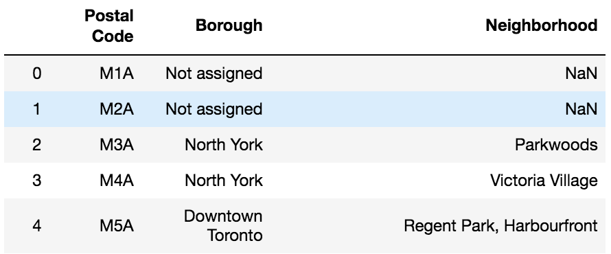
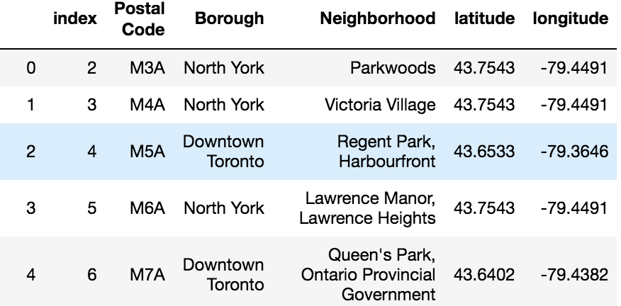

# Intro
Get the data of boroughs from Wikipedia

# Install
```
import requests
import pandas as pd

from bs4 import BeautifulSoup

import numpy as np
import json
!conda install -c conda-forge geopy --yes
from geopy.geocoders import Nominatim
from pandas.io.json import json_normalize
import matplotlib.cm as cm
import matplotlib.colors as colors
from sklearn.cluster import KMeans
import folium
%pip install geocoder
import geocoder
```

# Clustering
- Use the URL of Wikipedia to import dataframe dataset into Jupyter
```
URL = 'https://en.wikipedia.org/wiki/List_of_postal_codes_of_Canada:_M'
url = requests.get(URL)
soup = BeautifulSoup(url.content, "lxml") 

table = soup.find_all('table')[0] 
df = pd.read_html(str(table))[0]
```
First 5 rows of the imported dataframe for example.


- Drop unncessary rows then replace "/" to ",".
```
# drop rows with 'Not assigned' in Borough column
df = df[df.Borough != 'Not assigned'].reset_index()

df['Neighborhood'] = df['Neighborhood'].str.replace("/", ",")
```

- Create new columns for latitudes and longitudes then use Foursquare API to get latitudes and longitudes and apply them to new columns.
```
# Use Postal Code to get latitude and logitude and apply to the new columns

df['latitude']=""
df['longitude']=""

y=0
for x, z in zip(df.loc[:,'Borough'], df.loc[:,'Neighborhood']):
    geolocator = Nominatim(user_agent="foursquare_agent")
    location = geolocator.geocode("{}, {}, Toronto, Ontario, Canada".format(x,y ), timeout=None)
    df.loc[y, 'latitude'] = location.latitude
    df.loc[y, 'longitude'] = location.longitude
    y+=1
    if y==103:
        break
```

The first 5 rows of the result of the new dataframe with latitudes and longtidues added is below


