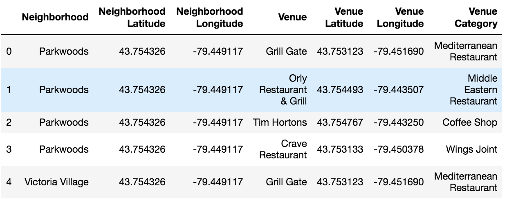

# Intro
Get the data of boroughs from Wikipedia

# Install
```
import requests
import pandas as pd

from bs4 import BeautifulSoup

import numpy as np
import json
!conda install -c conda-forge geopy --yes
from geopy.geocoders import Nominatim
from pandas.io.json import json_normalize
import matplotlib.cm as cm
import matplotlib.colors as colors
from sklearn.cluster import KMeans
import folium
%pip install geocoder
import geocoder
```

# Clustering
- Use the URL of Wikipedia to import dataframe dataset into Jupyter
```
URL = 'https://en.wikipedia.org/wiki/List_of_postal_codes_of_Canada:_M'
url = requests.get(URL)
soup = BeautifulSoup(url.content, "lxml") 

table = soup.find_all('table')[0] 
df = pd.read_html(str(table))[0]
```
First 5 rows of the imported dataframe for example.


- Drop unncessary rows then replace "/" to ",".
```
# drop rows with 'Not assigned' in Borough column
df = df[df.Borough != 'Not assigned'].reset_index()

df['Neighborhood'] = df['Neighborhood'].str.replace("/", ",")
```

- Create new columns for latitudes and longitudes then use ***geolocator*** get latitudes and longitudes and apply them to new columns.
```
# Use Postal Code to get latitude and logitude and apply to the new columns

df['latitude']=""
df['longitude']=""

y=0
for x, z in zip(df.loc[:,'Borough'], df.loc[:,'Neighborhood']):
    geolocator = Nominatim(user_agent="foursquare_agent")
    location = geolocator.geocode("{}, {}, Toronto, Ontario, Canada".format(x,y ), timeout=None)
    df.loc[y, 'latitude'] = location.latitude
    df.loc[y, 'longitude'] = location.longitude
    y+=1
    if y==103:
        break
```

The first 5 rows of the result of the new dataframe with latitudes and longtidues added are below


- Create a map of Toronto and add markers to map
```
# create map of Toronto using latitude and longitude values
location_toronto = geolocator.geocode("Toronto, Ontario, Canada")
map_toronto = folium.Map(location=[location_toronto.latitude, location_toronto.longitude], zoom_start=10)

df.loc[:, 'latitude'].astype('float')
df.loc[:, 'longitude'].astype('float')

# add markers to map
for lat, lng, borough, neighborhood in zip(df['latitude'], df['longitude'], df['Borough'], df['Neighborhood']):
    label = '{}, {}'.format(neighborhood, borough)
    label = folium.Popup(label, parse_html=True)
    folium.CircleMarker(
        [lat, lng],
        radius=5,
        popup=label,
        color='blue',
        fill=True,
        fill_color='#3186cc',
        fill_opacity=0.7,
        parse_html=False).add_to(map_toronto)
```


- Define Foursquare credentials, version, etc. and define the function to get venues nearby for each borough.
```
# Define Foursquare Credentials and Version
CLIENT_ID = '3MAR2Y4AH5PUQKHSI4TCMUQMLU2S45MO0TVJAKMHDDHAGINK' #  Foursquare ID
CLIENT_SECRET = 'SRPNGW0J3R5EFCSNVENLIXE4BUCCI0X2EEDBYRZTGYLY4HL3' #  Foursquare Secret
VERSION = '20180605' # Foursquare API version
radius=500
LIMIT = 50

def getNearbyVenues(names, latitudes, longitudes, radius=500):
    
    venues_list=[]
    for name, lat, lng in zip(names, latitudes, longitudes):
        print(name)
            
        # create the API request URL
        url = 'https://api.foursquare.com/v2/venues/explore?&client_id={}&client_secret={}&v={}&ll={},{}&radius={}&limit={}'.format(
            CLIENT_ID, 
            CLIENT_SECRET, 
            VERSION, 
            lat, 
            lng, 
            radius, 
            LIMIT)
            
        # make the GET request
        results = requests.get(url).json()["response"]['groups'][0]['items']
        
        # return only relevant information for each nearby venue
        venues_list.append([(
            name, 
            lat, 
            lng, 
            v['venue']['name'], 
            v['venue']['location']['lat'], 
            v['venue']['location']['lng'],  
            v['venue']['categories'][0]['name']) for v in results])

    nearby_venues = pd.DataFrame([item for venue_list in venues_list for item in venue_list])
    nearby_venues.columns = ['Neighborhood', 
                  'Neighborhood Latitude', 
                  'Neighborhood Longitude', 
                  'Venue', 
                  'Venue Latitude', 
                  'Venue Longitude', 
                  'Venue Category']
    
    return(nearby_venues)
```

- Use the def function to get nearby venues and add it to the new dataframe.

```
# def function on each neighborhood and create a new dataframe
toronto_venues = getNearbyVenues(names=df['Neighborhood'],
                                   latitudes=df['latitude'],
                                   longitudes=df['longitude']
                                  )
```
Newly created dataframe look like below

